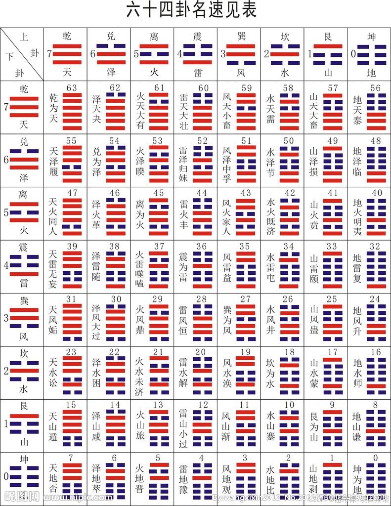

## 六爻金钱卦原理
六爻金钱卦是通过三枚铜钱（或硬币）的正反面组合来确定一个爻，每摇一次确定一爻，共摇六次，从下往上依次记录，从而得到一个六爻卦象。正面记为阳，反面记为阴，有老阳（三个正面）、老阴（三个反面）、少阳（两个正面一个反面）、少阴（两个反面一个正面）之分。老阳和老阴是变爻，会引发卦象的变化 。

## 地支的确定
在六爻占卜中，地支的确定是通过“纳甲法”来实现的。以下是具体的规则和方法：

1. **八卦的阴阳分类**：
    - 阳卦：乾、坎、艮、震。
    - 阴卦：巽、离、坤、兑。

2. **地支的阴阳分类**：
    - 阳支：子、寅、辰、午、申、戌。
    - 阴支：丑、卯、巳、未、酉、亥。

3. **地支的分配规则**：
    - **阳卦配阳支**：阳卦从初爻开始，按照阳支的顺序顺排。
    - **阴卦配阴支**：阴卦从初爻开始，按照阴支的顺序逆排。

4. **具体地支分配**：
    - **阳卦**：
        - 乾卦：初爻为子，依次为寅、辰、午、申、戌。
        - 震卦：初爻为子，依次为寅、辰、午、申、戌。
        - 坎卦：初爻为寅，依次为辰、午、申、戌、子。
        - 艮卦：初爻为辰，依次为午、申、戌、子、寅。
    - **阴卦**：
        - 坤卦：初爻为未，依次为巳、卯、丑、亥、酉。
        - 兑卦：初爻为巳，依次为卯、丑、亥、酉、未。
        - 离卦：初爻为卯，依次为丑、亥、酉、未、巳。
        - 巽卦：初爻为丑，依次为亥、酉、未、巳、卯。

5. **地支与五行的对应关系**：
    - 地支与五行的关系：子（水）、丑（土）、寅（木）、卯（木）、辰（土）、巳（火）、午（火）、未（土）、申（金）、酉（金）、戌（土）、亥（水）。

通过以上规则，可以确定每个六爻卦中各爻的地支，并结合五行生克关系进行分析。

### 纳甲

阳卦（乾震坎艮）是十二地支顺序间隔一位纳甲，阴卦（坤巽离兑）是十二地支逆序间隔一位纳甲

乾内甲子外壬午，坎内戊寅外戊申。

震内庚子外庚午，艮内丙辰外丙戌。

坤内乙未外癸丑，巽内辛丑外辛未。

离内己卯外己酉，兑内丁巳外丁亥。

### 安世应
世爻一般为自己，应爻为所求的事或人

寻世从初往上轮，阴爻变阳阳变阴；

变至内外相同卦，该爻即为世所临；

若到五爻卦仍异，转从四爻往下行；

若到初爻方为止，归魂世在三爻临；

内外相同勿需变，六爻安世为八纯；

若问应爻安何处，世隔两爻即为应。

### 定六亲

找卦宫
一二三六外卦宫，四五游魂内变更，回魂内卦是本宫。

以主卦所处卦宫的五行来定“我”

生“我”者为父母
同“我”者为兄弟
“我”克者为妻财

克“我”者为官鬼
“我”生者为子孙

### 装六神
以日辰的天干来排
甲乙起青龙，丙丁起朱雀，戊日起勾陈，己日起螣蛇，庚辛起白虎，壬癸起玄武。

### 飞神与伏神
“卦象排出后，有时卦中没有需要取做用神的六亲，这种现象在六爻预测中称为用神不现。
用神不现就需找伏藏，因本宫(即每宫首卦)六亲俱全，该宫中所有的卦都是从本宫演变而来，因此没有用神就可以到本宫去找。

１、装卦名

确定卦的名称，该卦属于何宫，及五行属性。纳甲法把六十四卦分为八宫，每宫八卦

乾宫八卦，属金。乾为天，天风女后，天山遁，天地否，风地观，山地剥，火地晋，火天大有。

艮宫八卦，属土。艮为山，山火贲，山天大畜，山泽损，火泽睽，天泽履，风泽中孚，风山渐。

震宫八卦，属木。震为雷，雷地豫，雷水解，雷风恒，地风升，水风井，泽风大过，泽雷随。

巽宫八卦，属木。巽为风，风天小畜，风火家人，风雷益，天雷无妄，火雷噬嗑，山雷颐，山风蛊。

离宫八卦，属火。离为火，火山旅，火山鼎，火水未济，山水蒙，风水涣，天水讼，天火同人。

坤宫八卦，属土。坤为地，地雷复，地泽临，地天泰，雷天大壮，泽天诀，水天需，水地比。

兑宫八卦，属金。兑为泽，泽水困，泽地萃，泽山咸，水山蹇，地山谦，雷山小过，雷泽归妹。

八卦图的南北东西，正与现代地图上北下南相反，而是上南下北。其次每宫第一卦都是由相同的两个单卦重迭而成的，总称为八纯卦。八纯卦是该宫的宫主。因此以八纯卦的名称来命宫名，以八纯卦的五行属性，统领该宫的另外七个卦。如乾卦属金，乾宫即属金，以下天风女后、天山遁、天地否、风地观、山地剥、火地晋、火天大有，都属金。除八纯卦之外，其他卦的名称来命法是从上往下，以八卦的第一主象为标志来命名的。乾为天，坎为水，艮为山，震为雷，巽为风，坤为地，兑为泽。例如地天泰卦，上卦为坤，坤为地，下卦为乾，乾为天，所以叫地天泰卦。天地否卦，则上卦为乾，为天，下卦为坤，为地，所以称为天地否卦，每一宫内又根据排列次序分别为六世卦、一世卦、二世卦、三世卦、四世卦、五世卦、游魂卦、归魂卦。确定卦名及其五行属性，是纳甲法最关键的一步。记住六十四卦的卦名（要达到熟知××××卦×宫×世卦属×）是需要下一番苦功的。

２、装世应

世与应是预测中使用较多的概念，一般把世当作自己或自己的方面，把应当作他人或与自己对立的方面。卦中装世应，就是确定卦中哪一爻是世爻，哪一爻是应爻。世与应在卦中，都是中间隔两位。如世在初爻则应在四爻；世在二爻，应在五爻；世在三爻，应在六爻；世在四爻，应在一爻；世在五爻，应在二爻；世在六爻，应在三爻。世与应中间隔着的两爻，叫间爻。

确定卦的世爻，依据的是前面所讲的卦在八宫中的位置。八纯卦为六世卦，顾名思义，八纯卦的世在六爻也就是上爻。一世卦世在初爻，二世卦世在二爻，三世卦世在三爻，四世卦世在四爻，五世卦世在五爻，游魂卦世在四爻，归魂卦世在三爻。古人有一个确定世爻的歌诀，可供参考：

“八卦之首世六当，以下初爻轮上扬；游魂八卦四爻上，归魂八卦三爻详。”世爻确定后，应爻自然就定下来了。

３、装纳甲

古人认为装纳甲之法，可以究天地生育之理，认为乾纳甲、壬，坤纳乙、癸，上下相包，震巽坎离艮兑纳庚辛戊己丙丁，象征六子生于父母乾坤之中。与天干相配合，八卦又都在每一爻上规定了固定的地支。排卦装纳甲，就是依据八纯卦乾坎艮震巽离坤兑在每卦中所处的位置内外不同，给每个爻标出所代表的天干和地支。

乾卦在内卦，初爻起甲子，二爻为甲寅，三爻为甲辰；乾卦在外卦，四爻为壬午，五爻为壬申，六爻为壬戊。

因为乾卦属阳，所以配的天干地支都属阳，阳卦隔位顺数，内外卦六爻顺序为子寅辰、午申戊。

坤卦在内卦，初爻起乙未，二爻为乙巳，三爻为乙卯；坤卦在外卦，四爻为癸丑，五爻为癸亥，六爻为癸酉。

坤卦为阴，所以配的天干地支都属阴，阴卦隔位逆数，内外卦六爻顺序为未巳卯、丑亥酉。

坎卦在内卦，初爻起戊寅，二爻为戊辰，三爻为戊午；在外卦，四爻为戊申，五爻戊戌，六爻为戊子。

艮卦在内卦，初爻为丙辰，二爻为丙午，三爻为丙申；艮卦在外卦，四爻丙戌，五爻为丙子，六爻为丙寅。

震卦为长子，卦有长子代父之说，震卦纳的地支与乾卦完全相同，只是天干为庚。在内卦，初爻起庚子，二爻为庚寅，三爻为庚辰；在外卦，四爻起庚午，五爻为庚戌。

巽卦在内卦，初爻起辛丑，二爻为辛亥，三爻为辛酉；巽卦在外卦，四爻为辛未，五爻为辛巳，六爻为辛卯。

离卦在内卦，初爻为己卯，二爻为己丑，三爻为己亥；在外卦，四爻为己酉，五爻为己未，六爻己巳。

兑卦在内卦，初爻为丁巳，二爻为丁卯，三爻为丁丑；在外卦，四爻为丁亥，五爻丁酉，六爻为丁未。

有一个简单的歌诀：

乾在内子寅辰，乾在外午申戌；巽在内丑亥酉，巽在外未巳卯；坎在内寅辰午，坎在外申戌子；离在内卯丑亥，离在外酉未巳；艮在内辰午申，艮在外戌子寅；兑在内巳卯丑，兑在外亥酉未；震在内子寅辰，震在外午申戌；坤在内未巳卯，坤在外丑亥酉。

例：得一雷风恒卦，内卦为风，即巽在内初爻为丑，二爻为亥，三爻为酉；外卦为雷，即震在外，四爻为午，五爻为申，六爻为戌。

４、装五行

根据卦中每爻的地支，标上五行金水木火土，十二地支与五行配合如下：子为水，丑为土，寅为木，卯为木，辰为土，巳为火，午为火，未为土，申为金，酉为金，戌为土，亥为水。

５、装六亲

六亲指父母、子孙、官爻、妻财、兄弟五类象征性的名词。这五类与卦身合在一起，总称六亲。六亲（卦身除外，以下同）依据五行的生克来确定。五行相生是金生水、水生木、木生火、火生土、土生金。五行相克是金克木、木克土、土克水、水克火、火克金。简单记法，以金水木火土为序（注意第二位为水，不是木，与俗称金木水火土不同！）顺数生邻位，克隔一位。用八个字来说即“邻位相生、隔位相克”。

确定六亲以该卦所在宫的五行属性为我，以卦中各爻的五行属性为他，看他和我的生克关系，是他来生我，还是我生他，是他克我，还是我克他，按“生我者父母。我生子孙，克我者官爻，我克者妻财，比和者兄弟”的规则来确定每爻是何六亲。

如测得地水师卦，该卦为坎宫归魂卦，坎宫属水，即我为水：

六爻 酉 金 父母（金生水，生我者父母）。

五爻 亥 水 兄弟（水与水相同为比和，比和者兄弟）。

四爻 丑 土 官爻（土克水，克我者官爻）。

三爻 午 火 妻财（水克火，我克者妻财）。

二爻 辰 土 官爻（土克水，克我者官爻）。

初爻 寅 木 子孙（水生木，我生者子孙）。

６、安卦身

纳甲法中的卦身有两种，一种叫卦身，又叫月卦身。第二种叫世身，称为“身居×爻”，后一种卦身每卦必有；前一种卦身，有的卦有，有的卦中则没有，称“身不入卦”。这两种卦身取法都与卦与卦中的世爻有关，只是取法不同。

安月卦身，看世爻的阴阳。诀曰：阴世则从午月起，阳世还从子月生；欲得识其卦中意，从初数至世方真。如测得巽为风卦，六爻世，世为阳爻，从初爻为子数起，二为丑、三寅、四卯、五辰、六为巳，巽卦第五爻辛巳，所以第五爻为卦身。

安世身，看世爻的地支。诀曰：子午持世身居初，丑未持世身居二。寅申持世身居三，卯酉持世身居四。辰戌持世身居五，巳亥持世身居六。如火地晋，为乾宫游魂卦，世在四爻，地支为酉，依“卯酉持世身在四。”身在四爻，与世同位。

７、记日月

预测的月日，是一个重要的因素，测卦时首先要用天干和地支记下预测的月和日，有时也需要年和时。月份以农历推算比较方便，农历月份的地支是固定的，正月为寅，二月为卯，在月为辰，四月为巳，五月为午，六月为未，七月为申，八月为酉，九月为戌，十月为亥，十一月为子，腊月为丑。

但需要注意，在预测中，月份的起止日，不是按农历的每月初一起，三十（或二十九）止。而是按照节气的起止日算。立春为正月节，惊蛰为二月节，清明为三月节，立夏为四月节，芒种为五月节，小暑为六月节，立秋为七月节，白露为八月节，寒露为九月节，立冬为十月节，大雪为十一月节，小寒为十二月（腊月）节。如头年十二月二十五日立春，就从头年十二月二十五日起正月，止于今年的惊蛰前。如头年十二月二十五日立春后算卦，月份就为寅，而不是头一年腊月的丑。

日的干支推算比较复杂，可借助《万年历》查定。卦的五行和六亲确定后，月和日也要记上五行和六亲。

８、装六兽

六兽，也称为“六神”。依次为一青龙、二朱雀、三勾陈、四腾蛇、五白虎、六玄武。

卦中装六兽主要依据测日的天干，诀曰：甲乙起青龙，丙丁起朱雀；戊日起勾陈，己日起腾蛇；庚辛起白虎，壬癸起玄武。即如果甲日或乙日预测，卦的初爻为青龙，二爻为朱雀，三爻为勾陈，四爻为腾蛇，五爻为白虎，六爻为玄武。列表如下：

甲乙日 丙丁日 戊日 己日 庚辛日 壬癸日

六爻 玄武 　青龙　朱雀 勾陈　腾蛇　白虎

五爻 白虎 　玄武　青龙 朱雀　勾陈　腾蛇

四爻 腾蛇 　白虎　玄武 青龙　朱雀　勾陈

三爻 勾陈 　腾蛇　白虎 玄武　青龙　朱雀

二爻 朱雀 　勾陈　腾蛇 白虎　玄武　青龙

初爻 青龙　 朱雀　勾陈 腾蛇　白虎　玄武

９、装变爻

卦遇变爻，要把变化出来的爻装上纳甲、五行、六亲。先确定变出什么卦，变爻在内卦只变内卦，变爻在外卦，只变外卦。内外卦都有变爻则全变。但记时，只记有变化的爻，没有变化的爻则不重标纳甲、五行和六亲。变爻装纳甲和五行，以变出的卦是在内还是在外。如变出的卦是乾卦在内，则以“乾在内子寅辰”记。但在装六亲的时候，不以变后卦所在宫为“我”，仍以所测得的本卦属性为“我”。

例“测得天地否之水地比卦。天地否为本卦，四爻和六爻两个变爻，都在外，内卦可以不记，外卦乾变为坎，依“坎在外，申戌子”记下四爻为戊申金，六爻为戊子水。天地否属乾宫，五行属金，水地比卦为坤宫属土，但水地比是变出来的卦，在装变爻六亲时，不以变卦属性为“我”，要还乾宫金为“我”，四爻金为兄弟，六爻水为子孙。

## 八卦
